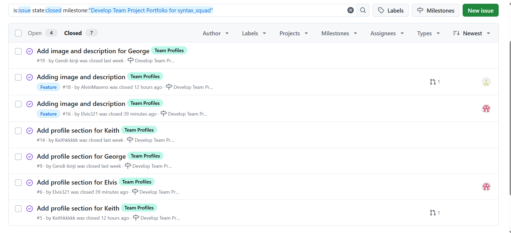
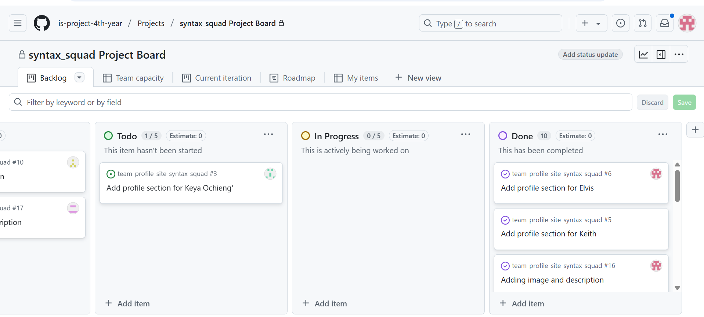
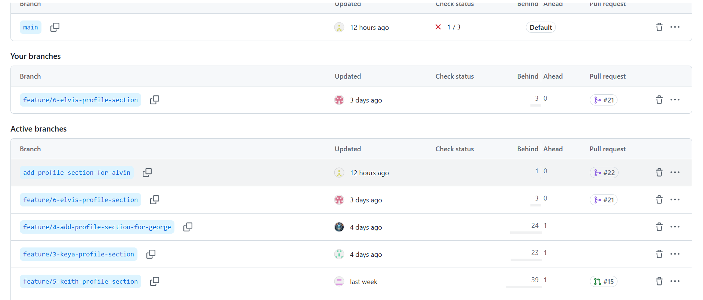
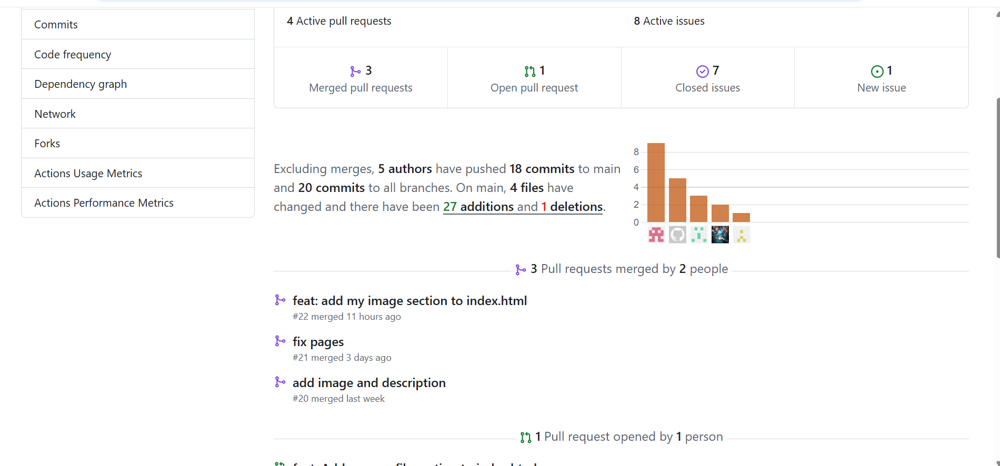
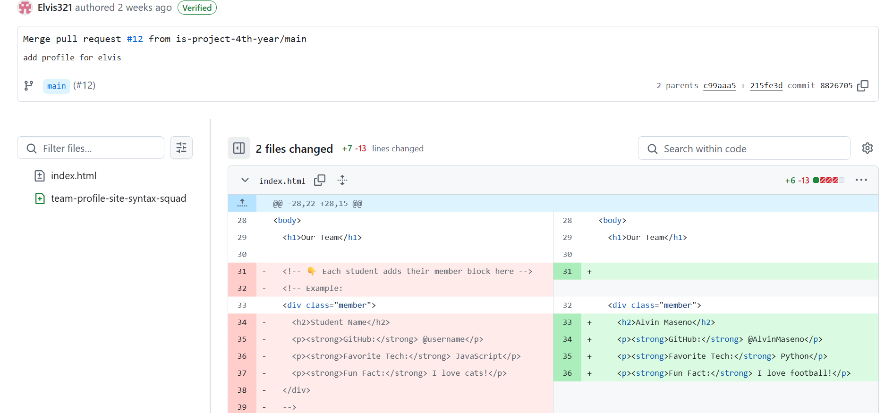

# Personal Portfolio Documentation

## 1. Student Details

- **Full Name**: Elvis Ernest Otengo
- **Admission Number**: 150028
- **GitHub Username**:@Elvis321
- **Email**: elvis.oteng'o@strathmore.edu

## 2. Deployed Portfolio Link

- **GitHub Pages URL**:  
  _ https://is-project-4th-year.github.io/team-profile-site-syntax-squad/

## 3. Learnings from the Git Crash Program

**🧠 What I Thought I'd Learn vs What I Actually Learned**
**1. Concept: Branching**

`Expectation 👀` : I thought branching was not complicated just a way for different people to work on the same project.

`Reality 😅`: Branching entails a lot more especially things like resolving conflicts and also branching is used in solo developing.

`Impact 💡`: I created a feature branch for my "Profile details" section and merged it smoothly into the main branch after testing. 
**2. Concept: Conflicts**

`Expectation 👀` : I was never aware about merge conflicts before.

`Reality 😅`: Merge conflicts can occur pretty often especially when working on a project with other people.

`Impact 💡`: I was able to resolve all the conflicts and managed to merge with the main branch.
**3. Concept: Projects**

`Expectation 👀` : I was never aware about projects before and what it was about.

`Impact 💡`: I was able to understand the purpose of a project and how it can be used to monitor the progress of a project and was able to create a project for my group.
**4. Concept: Milestones and Issues**

`Expectation 👀` : I was never aware about milestones and issues before and what it was about.

`Impact 💡`: I was able to understand the purposes of issues especially in committing code and the use of milestones. I was able to create multiple issues and assign them to various commits.

## 4. Screenshots of Key GitHub Features

### A. Milestones and Issues

*This screenshot shows how I created milestones to organize project phases and linked related issues to track progress.*

---

### B. Project Board

*This screenshot shows the project board with columns for “To Do”, “In Progress”, and “Done” to visually track work items.*

---

### C. Branching

*This screenshot shows a list of branches with clear, meaningful names to support feature development and collaboration.*

---

### D. Pull Requests

*This screenshot shows a pull request that is properly linked to an issue, documenting the review and merge process.*

---

### E. Merge Conflict Resolution

*This screenshot shows how I resolved a merge conflict during a pull request merge, either using GitHub or a local tool.*

