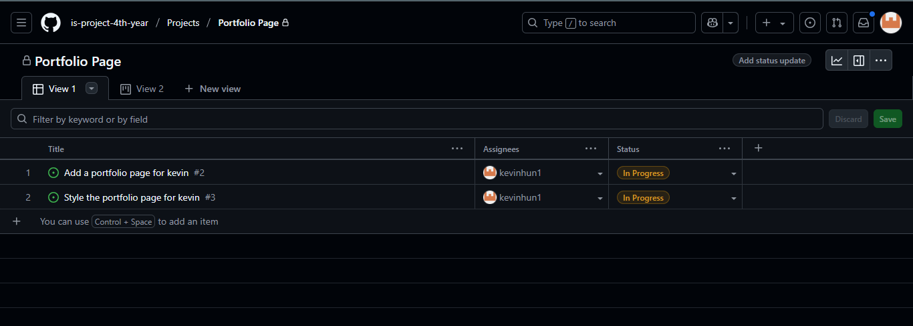
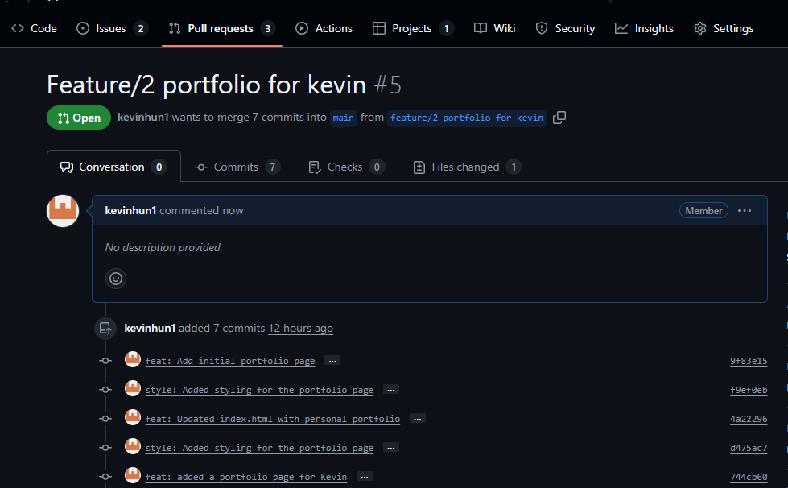
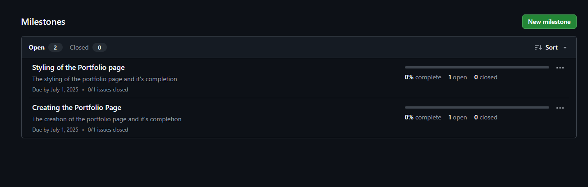
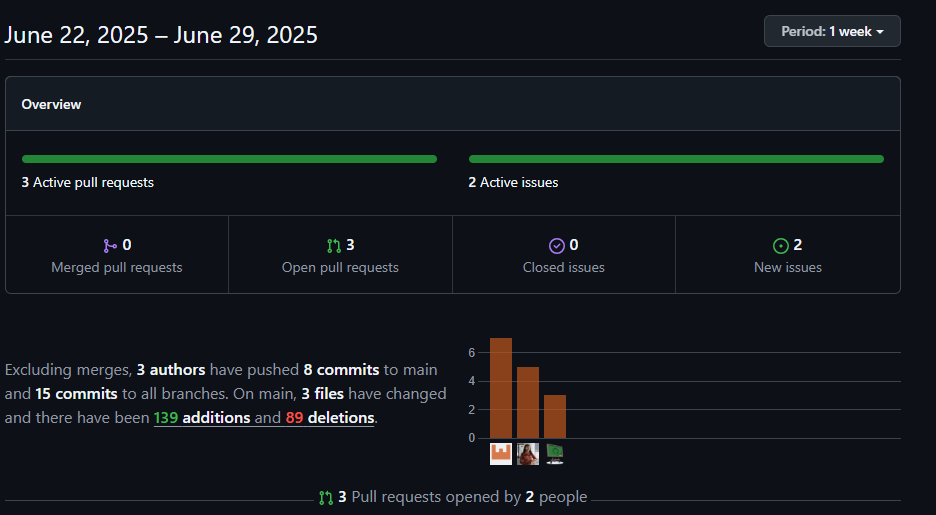

# Personal Portfolio Documentation

## 1. Student Details

- **Full Name**: Kevin Ndyabandiho
- **Admission Number**: 122787
- **GitHub Username**: kevinhun1
- **Email**: needfspeed234@gmail.com

## 2. Deployed Portfolio Link

- **GitHub Pages URL**:  
  https://is-project-4th-year.github.io/build-your-portfolio-github-workflow-essentials-kevinhun1/

## 3. Learnings from the Git Crash Program

Write about **4 things** you expected to learn during the Git crash course (yes, we all came in with some big hopes 😅).
For each one, mention:

What you thought it would be like **(Expectation 👀)**

What you actually learned **(Reality 😅)**

And how it helped with your personal portfolio project 💻

make it honest—and if it surprised you, even better!

Example format:

**🧠 What I Thought I'd Learn vs What I Actually Learned**
**1. Concept: Branching**

`Expectation 👀` : I thought branching was just for developers working on big apps—nothing I’d need for a small project.

`Reality 😅`: Turns out even solo devs need branches! It helped me avoid breaking my main code while testing new designs.

`Impact 💡`: I created a feature branch for my "About Me" section and merged it smoothly into the main branch after testing. Super useful!

## 4. Screenshots of Key GitHub Features

Include screenshots that demonstrate how you used GitHub to manage your project. For each screenshot, write a short caption explaining what it shows.

> Upload the screenshots to your GitHub repository and reference them here using Markdown image syntax:
> (you could just simply copy and paste the image into the Assignment.md)



```markdown
Above screenshot describes the creation of a project in github.
```


```markdown
Above screenshot shows the issues created in the project.
```


```markdown
Above screenshot shows how pull requests were used to merge with the main branch.
```


```markdown
Above screenshot show how milestones were used to complete the project.
```



```markdown
Above screenshot visualizes the commit history.
```