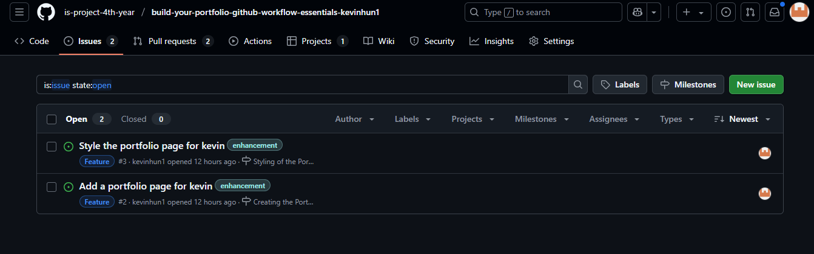

# Personal Portfolio Documentation

## 1. Student Details

- **Full Name**: Saleh Saleh Mohamed
- **Admission Number**: **147166**
- **GitHub Username**: **salehalkithiry**
- **Email**: **saleh.saleh@strathmore.edu**

## 2. Deployed Portfolio Link

- **GitHub Pages URL**:  
 https://is-project-4th-year.github.io/build-your-portfolio-github-workflow-essentials-salehalkithiry/#

## 3. Learnings from the Git Crash Program

Write about **4 things** you expected to learn during the Git crash course (yes, we all came in with some big hopes 😅).
For each one, mention:

**🧠 What I Thought I'd Learn vs What I Actually Learned**
**1. Concept: Pull Requests**

`Expectation 👀` :  I assumed pull requests were only needed when working with others or contributing to open source.

`Reality 😅`:  Pull requests are helpful even when working alone! They make it easy to review what I changed before merging.

`Impact 💡`:  I opened a PR for every feature I worked on and linked it to the relevant issue, improving my workflow and tracking.

**2. Concept: Merge Conflicts**

`Expectation 👀` : I thought merge conflicts were scary and something I’d avoid at all costs.

`Reality 😅`: I learned how to intentionally simulate one, resolve it, and understand what was happening. Not so scary after all!

`Impact 💡` : I created a branch that edited the same line as main, triggered a conflict, and resolved it cleanly during the PR.

**3. Concept: GitHub Pages Deployment**

`Expectation 👀` : I expected it to be technical and complicated, maybe requiring extra tools.

`Reality 😅` : GitHub Pages was super easy to use—just choose the main branch and hit publish.

`Impact 💡` : I successfully deployed my portfolio and shared a live version of my work. This helped me showcase my skills professionally.

**4. Concept: Structured Commit Messages**

`Expectation 👀`: I assumed commit messages didn’t really matter—just a quick “fixed it” or “done” would do the job.

`Reality 😅`: I learned that meaningful, well-structured commit messages make it much easier to track changes, understand history, and collaborate (even with your future self!).

`Impact 💡`: I followed the format using feat, fix, docs, etc., and wrote short but clear messages like feat(contact): add responsive contact form. It helped keep my Git history clean and professional.


## 4. Screenshots of Key GitHub Features

Include screenshots that demonstrate how you used GitHub to manage your project. For each screenshot, write a short caption explaining what it shows.

> Upload the screenshots to your GitHub repository and reference them here using Markdown image syntax:
> (you could just simply copy and paste the image into the Assignment.md)

```markdown

```

### A. Milestones and Issues
```markdown


Caption: Screenshot showing milestones created for each section (e.g., About, Contact, Footer) and issues linked to them.
```

### B. Project Board
```markdown

Caption: My GitHub Project Board with issues organized into To Do, In Progress, and Done columns.
```

### C. Branching
```markdown

Caption: Branch list showing feature branches with meaningful names like feature/5-contact-section, 9-merge-conflict-simulation, etc.
```

### D. Pull Requests
```markdown

Caption: A pull request linked to the conflict section issue, commits, and successful merge.
```

### E. Merge Conflict Resolution
```markdown

Caption: Screenshot showing how I resolved a merge conflict between two branches editing the same About Me paragraph.
```